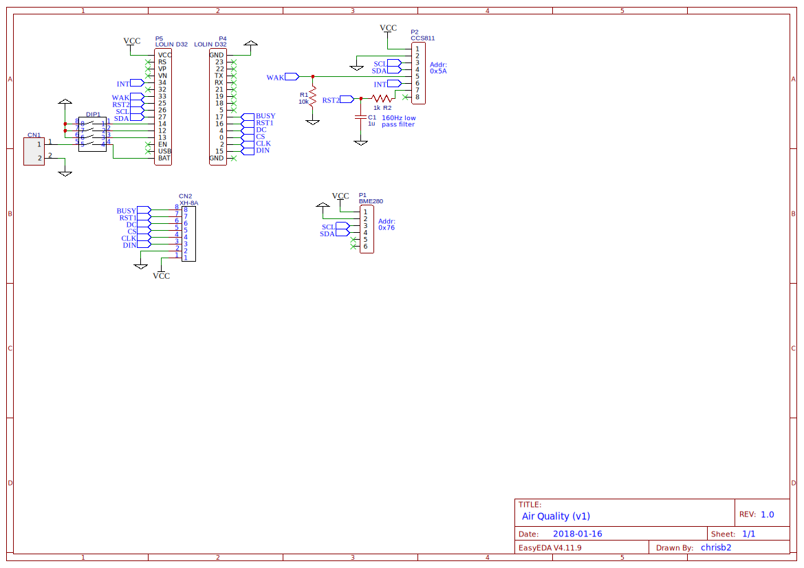

# air-quality
An air quality sensor and display. Uses the [BME280](https://www.bosch-sensortec.com/bst/products/all_products/bme280) and [CCS811](https://ams.com/ccs811) sensors to read temperature, relative humidity, equivalent CO2 (eCO2) and Total Volatile Organic Compound (TVOC) and displays the values on a [2.9in Waveshare](https://www.waveshare.com/product/2.9inch-e-paper-module.htm) e-Paper display.

## Schematic

If the schematic appears to be missing details, download it and view it locally, or zoom the web page.

## Installation

The program has been written and tested with the standard [esp32 Micropython firmware](http://micropython.org/download#esp32) installed on a [Lolin D32](https://wiki.wemos.cc/products:d32:d32) development board, although with some adjustments I would expect it to work on other esp32 boards and on the esp8266.

To install; flash the standard esp32 Micropython firmware, then copy all the Python files to the esp32 and reset the esp32.

## Usage

The CCS811 sensor must be 'burned-in' (see data sheet) for at least 1 hour (newer CCS811 firmware), or 48 hours (older CCS811 firmware). To do this simply leave powered on for the appropriate time.

In addition the CCS811 sensor must be 'conditioned' for 20 minutes after being powered on before accurate readings are generated (see data sheet). During this period the display will show a long dash for the eCO2 and TVOC values.

The display is refreshed once per minute with the esp32, ccs811 MCU and display sleeping in the interval between refreshes.

The battery voltage is displayed in the top right hand corner of the display.

### ccs811 Baseline

The ccs811 sensor has the ability to use a predetermined baseline against which new readings are calculated, this allows a baseline obtained in clean air to be used to measure values in a more polluted environment.

Place the device in clean air and wait for it to be 'conditioned' (readings for eCO2 are TVOC displayed). Operate switch 1 to the on position (connects pin 14 to GND) and wait for next display update (LED on Lolin D32 flashes), turn switch 1 off. The baseline is now stored and will be utilized every time the device is switch on. A new baseline can be set by repeating this process as required.

## CCS811 Firmware Upgrade

**WARNING - DO THIS AT YOUR OWN RISK, IT MAY BRICK THE SENSOR**

The Python program _ccs811_firmware_upgrade.py_ can be used to upgrade the CCS811 firmware, it is based on the ams application note AN000371: Downloading new Application Firmware (v2).

Check the current application firmware version in the sensor as described in the datasheet.

Download the new firmware binary from the ams website, copy to the esp32 and run the program.

## Acknowledgements

CCS811 module based on [Notthemarsian/CCS811](https://github.com/Notthemarsian/CCS811)

BME280 module based on [catdog2/mpy_bme280_esp8266](https://github.com/catdog2/mpy_bme280_esp8266)

e-Paper module based on [mcauser/micropython-waveshare-epaper](https://github.com/mcauser/micropython-waveshare-epaper/blob/master/epaper2in9.py)

[Hershey](http://paulbourke.net/dataformats/hershey/) vector font from [Experimenting with E-Paper Displays: Building a Clock!](https://www.element14.com/community/groups/open-source-hardware/blog/2017/12/31/experimenting-with-e-paper-displays-building-a-clock)
